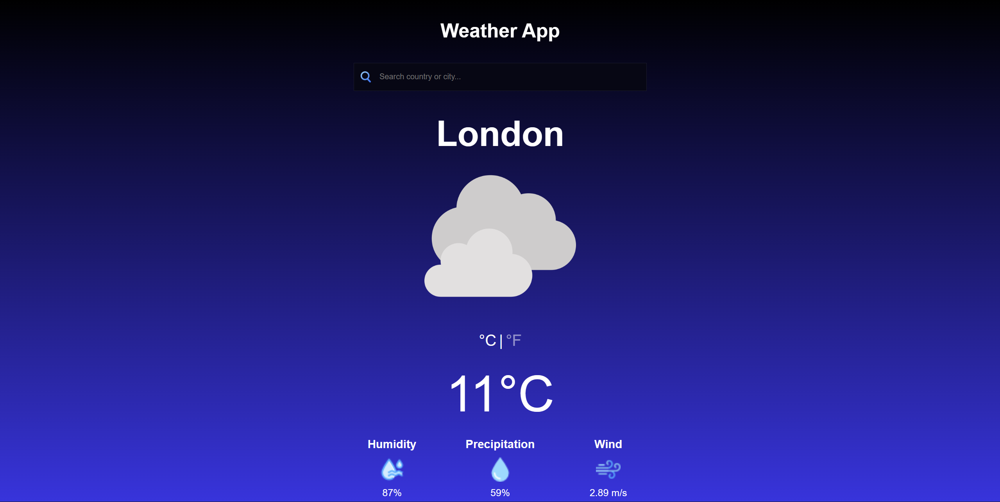
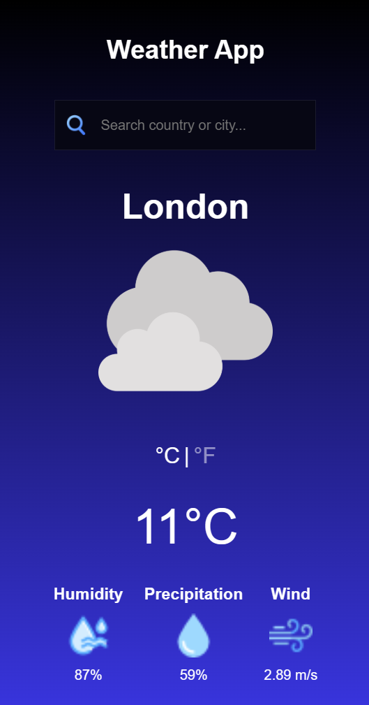

# Weather-App
Weather App designed by figma, the technologies that were used are html / css / js. Openweather API was used to fetch data

## Live Demo
[View Live Demo] ()

## Screenshots
- Desktop Design

- Mobile Design

## Features

- Fully Responsive design
- Weather API fetch to display data
- Toggle betweeen Celsius and Fahrenheit
- Weather images change based on weather

## Technologies Used

- HTML5
- CSS3
- JavaScript